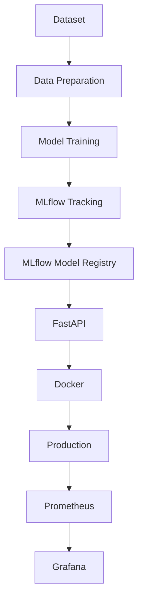
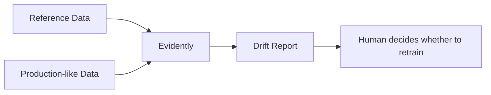

# ChurnOps — Production ML & MLOps Pipeline

A beginner-friendly, production-**style** MLOps project. It predicts
whether a telecom customer will churn — but the real point of this
repo isn't the model, it's everything **around** the model: tracking
experiments, versioning models, serving predictions, containerizing
the service, running CI, monitoring it in production, and detecting
when the data feeding it has drifted.

**Split intentionally:** ~25% machine learning, ~75% MLOps.

## Why this project exists

Most ML tutorials stop at "train a model and print accuracy." In the
real world, that's maybe 10% of the work. The rest is: how do you
track what you tried, how do you know which model version is live,
how do other systems call your model, how do you know it's still
working next month, and how do you know when the world has changed
underneath it. This project builds a small, complete version of that
whole lifecycle — simple enough to read end-to-end in one sitting.

If you're new to any of the concepts here, read
**[docs/learning-guide.md](docs/learning-guide.md)** first — it explains
*why* each piece of the stack exists, not just how to run it. For
interview prep, see **[docs/interview-questions.md](docs/interview-questions.md)**.

---

## Architecture



Drift detection runs as a separate, parallel workflow:



## Tech stack

| Layer | Tool | Why |
|---|---|---|
| ML | Pandas, scikit-learn | Simple, standard, everyone knows it |
| API | FastAPI, Pydantic, Uvicorn | Fast to write, validates input, gives free docs |
| Experiment tracking & registry | MLflow | Industry-standard, easy to run locally |
| Dataset versioning | DVC | Pairs large files with Git without bloating the repo |
| Testing | Pytest | Standard Python testing |
| Linting | Ruff | Fast, single-tool replacement for several linters |
| Containers | Docker, Docker Compose | Reproducible environment, one-command local stack |
| Monitoring | Prometheus, Grafana | Standard metrics scraping + visualization |
| Data drift | Evidently | Purpose-built drift reports, minimal setup |

Explicitly **not** used, on purpose: Kubernetes, Kafka, Spark, Airflow,
feature stores, cloud infrastructure, microservices. See
[docs/learning-guide.md](docs/learning-guide.md) for why keeping this
project small is a feature, not a limitation.

## Project structure

```
churnops/
├── app/                # FastAPI service (schemas, model loading, endpoints)
├── src/                # Data pipeline, training, evaluation, drift monitoring
├── tests/              # Pytest suite for data, model, and API
├── data/raw/           # Raw dataset (DVC-tracked)
├── data/processed/     # Train/val/test/reference splits (generated)
├── models/             # Present for structure; the API loads from the
│                       # MLflow Model Registry, not from files here
├── reports/            # Generated evaluation + drift reports
├── monitoring/          # prometheus.yml + Grafana provisioning/dashboard
├── configs/config.yaml  # Single source of truth for all settings
├── .github/workflows/   # CI pipeline
├── Dockerfile / docker-compose.yml
├── dvc.yaml              # One stage: regenerate processed data from raw
└── docs/                 # Learning guide + interview prep
```

## The ML problem

Binary classification: will this customer churn (`1`) or not (`0`)?
Dataset: [IBM Telco Customer Churn](https://www.kaggle.com/datasets/blastchar/telco-customer-churn)
(7,043 customers, one row per customer). Only 8 columns are used as
model input — the same 8 fields the API accepts — to keep training and
serving in lockstep:

```
tenure, monthly_charges, total_charges, contract,
internet_service, senior_citizen, partner, dependents
```

Model: **Logistic Regression** (scikit-learn), wrapped in a single
`Pipeline` with a `ColumnTransformer` for preprocessing. A
`random_forest` option exists in config for comparison, but Logistic
Regression is the default — it's simple, fast, and its coefficients
are interpretable, which matters more here than squeezing out an
extra percentage point of accuracy.

## Data pipeline (`src/data.py`)

```
raw CSV → select relevant columns → fix TotalCharges blanks →
encode Yes/No → churn Yes/No → 0/1 → train/val/test split → save CSVs
```

Run it:

```bash
python -m src.data
```

Outputs `data/processed/{train,val,test,reference}.csv`. `reference.csv`
is a copy of the training set, used later as the "normal" baseline for
drift detection.

## Training & evaluation (`src/train.py`, `src/evaluate.py`)

`src/train.py` builds the preprocessing+model `Pipeline`, fits it,
evaluates on the validation set, and logs everything to MLflow
(parameters, metrics, a confusion matrix, a classification report, and
the model itself, registered as a new version of `churn-model`).

`src/evaluate.py` is a separate script for evaluating an already
*registered* model version on the held-out **test** set — the check
you'd run right before promoting a candidate to production.

### Metrics — what they mean and why more than one

- **Accuracy**: how many predictions were correct overall. Misleading
  on imbalanced data — if only 20% of customers churn, always
  predicting "no churn" scores 80% accuracy while catching zero
  churners.
- **Precision**: of the customers we *predicted* would churn, how many
  actually did? High precision = few wasted retention offers.
- **Recall**: of the customers who *actually* churned, how many did we
  catch? High recall = few missed at-risk customers.
- **F1**: harmonic mean of precision and recall — one number balancing
  both.
- **ROC-AUC**: how well the model ranks churners above non-churners
  across every possible decision threshold.

There's no universal "best" metric — it depends on the cost of a false
positive (a wasted retention offer) versus a false negative (a churned
customer nobody tried to retain). That's a business decision, not a
math one.

## MLflow

**What:** experiment tracking + model registry.
**Why:** without it, every training run is a black box you can't
compare or reproduce.
**Where:** `src/train.py` (logging), `src/evaluate.py` /
`app/predictor.py` (loading), `src/promote_model.py` (promotion).

Concepts, once each:

| Term | Meaning |
|---|---|
| Experiment | A named folder grouping related runs (here: `churnops`) |
| Run | One execution of training, with its own params/metrics/artifacts |
| Parameter | A training input you chose (e.g. `model_type`) |
| Metric | A number measuring performance (e.g. `f1`) |
| Artifact | A file worth keeping (e.g. confusion matrix PNG) |
| Registered model | A named, versioned entry in the Model Registry (`churn-model`) |
| Model version | An immutable snapshot — v1, v2, v3, ... never overwritten |
| Alias | A movable pointer (e.g. `production`) to one specific version |

### Local MLflow setup

Port **5001**, not 5000 — on macOS, 5000 is often taken by the AirPlay
Receiver service.

```bash
mlflow server \
    --host 0.0.0.0 \
    --port 5001 \
    --backend-store-uri sqlite:///mlflow.db \
    --default-artifact-root ./mlartifacts
```

MLflow UI: **http://localhost:5001**

### Model promotion (registry lifecycle)

```
train → new model version registered → evaluate on test set →
manual decision → promote alias → API loads that alias
```

```bash
python -m src.evaluate --alias candidate      # check test-set performance
python -m src.promote_model --version 3 --alias production
```

The API always loads whichever version currently holds the
`production` alias — promoting a model is a one-line command, not a
code change or redeploy.

## FastAPI service (`app/`)

- `app/schemas.py` — Pydantic request/response models (validation).
- `app/predictor.py` — loads the `production` model **once** at
  startup (not per-request — that would add MLflow round-trip latency
  to every prediction) and exposes `predict()`.
- `app/main.py` — the endpoints and Prometheus metrics.

| Endpoint | Purpose |
|---|---|
| `GET /health` | Liveness check — always returns 200 |
| `POST /predict` | Churn prediction |
| `GET /model-info` | Which model name/version/alias is currently loaded |
| `GET /metrics` | Prometheus-format metrics |

Run locally:

```bash
uvicorn app.main:app --reload
```

Docs (Swagger UI): **http://localhost:8000/docs**

### Example request/response

```bash
curl -X POST http://localhost:8000/predict \
  -H "Content-Type: application/json" \
  -d '{
        "tenure": 12,
        "monthly_charges": 75.5,
        "total_charges": 850.0,
        "contract": "Month-to-month",
        "internet_service": "Fiber optic",
        "senior_citizen": 0,
        "partner": 1,
        "dependents": 0
      }'
```

```json
{
  "churn": true,
  "probability": 0.82,
  "model_version": "2"
}
```

If no model can be loaded (MLflow unreachable, alias not set yet),
`/predict` and `/model-info` return `503` — `/health` and `/docs` keep
working regardless, so the failure is visible and debuggable instead
of taking the whole app down.

## Docker & Docker Compose

```bash
docker build -t churnops-api .
docker run -p 8000:8000 churnops-api
```

Full local stack (API + MLflow + Prometheus + Grafana):

```bash
docker compose up --build
```

| Service | URL |
|---|---|
| API | http://localhost:8000 (docs at `/docs`) |
| MLflow | http://localhost:5001 |
| Prometheus | http://localhost:9090 |
| Grafana | http://localhost:3000 (login: `admin` / `admin`) |

**Note:** the Dockerized MLflow starts with an empty registry. After
`docker compose up`, train and promote a model against it once:

```bash
python -m src.train              # logs to http://localhost:5001
python -m src.promote_model --version 1 --alias production
docker compose restart api       # picks up the newly promoted model
```

## CI/CD (`.github/workflows/ci.yml`)

**CI (Continuous Integration)** — automatically checking every change:
lint, test, and confirm the Docker image builds and boots. This
project implements CI in full: Ruff → Pytest → Docker build → a
smoke-test HTTP call to `/health` inside the built container.

**CD (Continuous Deployment)** — automatically *shipping* a passing
build to a real environment. **This project does not implement CD** —
there's no cloud target to deploy to, and adding one would mean adding
cloud infrastructure, which is explicitly out of scope for this
learning project. See [docs/interview-questions.md](docs/interview-questions.md)
for how you'd extend this to real deployment.

## Prometheus & Grafana

Four metrics, on purpose — not dozens:

- `prediction_requests_total` — how many predictions were requested
- `prediction_errors_total` — how many failed
- `prediction_latency_seconds` — how long predictions take (histogram)
- `churn_predictions_total{outcome=...}` — predictions by outcome

Prometheus scrapes `GET /metrics` on the API every 15s (see
`monitoring/prometheus.yml`). Grafana auto-provisions Prometheus as a
datasource and loads the `ChurnOps API` dashboard automatically (see
`monitoring/grafana/provisioning/`) — no manual "add datasource" /
"import dashboard" clicking needed when running via `docker compose up`.

To view manually: open Grafana → Dashboards → ChurnOps → ChurnOps API.

## Data drift (`src/monitor.py`)

```bash
python -m src.monitor
```

Compares `data/processed/reference.csv` (the training distribution)
against `data/processed/test.csv` (standing in for "recent production
data") using Evidently's `DataDriftPreset`, and writes an HTML report
to `reports/drift_report.html`.

**This project deliberately does not auto-retrain on drift.** A drift
signal tells you the data *changed* — it doesn't tell you *why*, and
the right response might be retraining, or it might be "someone broke
the upstream data pipeline." Automatic retraining on an unverified
signal can quietly ship a worse model. A human should look first. See
[docs/learning-guide.md](docs/learning-guide.md) for more.

## Dataset versioning (DVC)

Git tracks code. DVC tracks the large dataset file, storing a small
`.dvc` pointer file (with a hash) in Git while the actual CSV lives in
a local DVC cache — no cloud storage required for this project.

```bash
git init          # already done in this repo
dvc init          # already done in this repo
dvc add data/raw/churn.csv
git add data/raw/churn.csv.dvc data/raw/.gitignore
git commit -m "Track raw dataset with DVC"
```

`dvc.yaml` defines one simple stage (`prepare_data`) so `dvc repro`
regenerates the processed CSVs whenever the raw data or `src/data.py`
changes — this is intentionally the *only* stage; DVC is used here for
versioning, not as a full pipeline orchestrator.

## Testing

```bash
pytest
```

- `tests/test_data.py` — the data pipeline loads, cleans, and splits correctly.
- `tests/test_model.py` — the training pipeline fits and predicts correctly.
- `tests/test_api.py` — API endpoints validate input and respond correctly
  (using a fake predictor, so tests don't need a running MLflow server).

## Linting

```bash
ruff check .
```

Configured in `pyproject.toml` — a small, beginner-friendly rule set
(pyflakes + pycodestyle + import sorting).

## Full local run-through

```bash
# 1. Set up
python3.12 -m venv .venv && source .venv/bin/activate
pip install -r requirements.txt
cp .env.example .env

# 2. Data
python -m src.data

# 3. MLflow server (separate terminal)
mlflow server --host 0.0.0.0 --port 5001 \
  --backend-store-uri sqlite:///mlflow.db \
  --default-artifact-root ./mlartifacts

# 4. Train + promote
python -m src.train
python -m src.promote_model --version 1 --alias production

# 5. Serve
uvicorn app.main:app --reload
# open http://localhost:8000/docs

# 6. Drift report
python -m src.monitor

# 7. Quality gates
pytest
ruff check .

# 8. Full containerized stack
docker compose up --build
```

## Future improvements

Kept out of scope on purpose, but worth knowing about for a real
production deployment:

- **Cloud deployment**: push the Docker image to a registry (ECR/GCR)
  and run it on a managed container service (ECS/Cloud Run) with a
  managed MLflow backend (RDS + S3) instead of local SQLite/files.
- **Automatic retraining**: trigger `src/train.py` on a schedule or on
  a confirmed drift signal, with a human approval gate before promotion.
- **A/B testing between model versions**: route a percentage of
  traffic to a `candidate` alias and compare live metrics before fully
  promoting.
- **Kubernetes**: only once you have multiple services or need
  autoscaling — a single FastAPI container behind Docker Compose is
  enough for this project's scale.
- **Feature store**: worth adding once multiple models/services need
  to share the same computed features consistently.

---

Written to be read end-to-end, not just run. If a section doesn't make
sense, that's a bug in the project (or the README) — see
[docs/learning-guide.md](docs/learning-guide.md) for the deeper
explanation of every concept referenced above.
